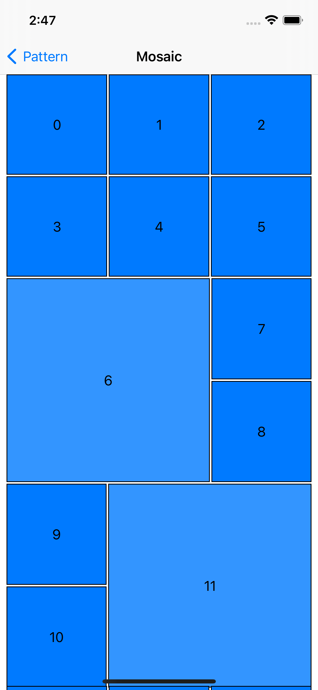

# collection-view-layout-pattern-sample
`UICollectionViewLayout` implementation pattern.

# About
This project is introduced in iOSDC Japan 2021.  
sample code for [slide](https://speakerdeck.com/to4iki/kesuniying-zitauicollectionviewfalsereiautoshi-zhuang-patan)

# Pattern
list | grid | mosaic | topAligned | detail
--- | --- | --- | --- | ---
 |  |  |  | 

* only the list pattern is using iOS 14.0+ API

### detail patten
<p align="left">
    
</p>

use [DetailSectionProvider](./CollectionViewLayoutPatternSample/View/Detail/DetailSectionProvider.swift) protocol

```swift
protocol DetailSectionProvider {
    func layoutSection(contentWidth: CGFloat, traitCollection: UITraitCollection) -> NSCollectionLayoutSection
    func provideCell(_ collectionView: UICollectionView, indexPath: IndexPath, item: DetailSectionItem) -> UICollectionViewCell
    func provideHeaderView(_ collectionView: UICollectionView, indexPath: IndexPath, section: DetailSection) -> UICollectionReusableView?
    func provideFooterView(_ collectionView: UICollectionView, indexPath: IndexPath, section: DetailSection) -> UICollectionReusableView?
}
```

```swift
struct DetailSectionModel {
    var provider: DetailSectionProvider
    var section: DetailSection
    var items: [DetailSectionItem]
}
```

## Requirements
Requires Xcode12 and iOS 14.0 or later.
